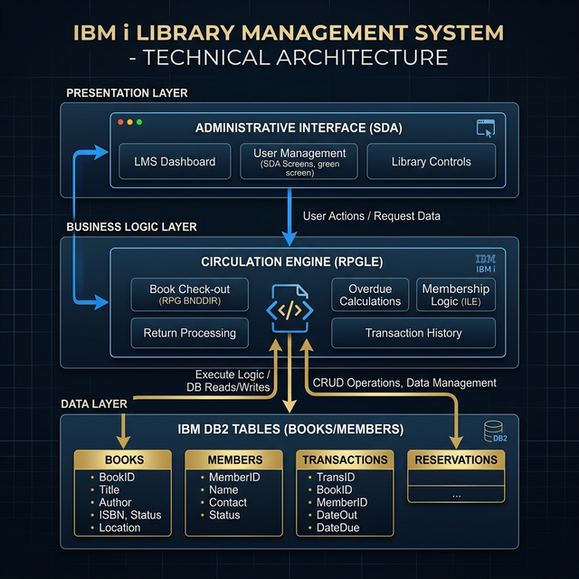

# 📚 Library Management System (IBM i Training Project)



A specialized inventory and membership management system designed on **IBM i (AS/400)**, focusing on relational data integrity and library circulation logic.

## 🚀 Key Features

- **Relational Data Design (DDS)**: Leverages Physical Files for book inventory and member management with unique keys.
- **Book Circulation Engine (RPGLE)**: Handles automated Issue and Return workflows with robust error handling for member status and book availability checks.
- **Administrative Interface**: Built via **SDA** (Screen Design Aid) to manage library records and data entry reporting.
- **CLLE Error Management**: Captures escape messages and provides a user-friendly diagnostic display to the librarian.

## 🛠️ Tech Stack

- **Languages**: RPGLE (Free-form), CLLE (Control Language), DDS (Data Description).
- **Tools**: SEU/RDP/VS Code, SDA (Screen Design Aid), IBM i Operating System.
- **Database**: DB2 for i (Physical Files).

## 📁 Repository Structure

```text
├── QDDSSRC/
│   ├── BOOKS.pf     # Book Inventory physical file
│   └── MEMBERS.pf   # Member Registry physical file
├── QRPGLESRC/
│   └── BOOK_CIRC.rpgle # Circulation logic module
├── QCLSRC/
│   └── INIT_PGM.clle   # Initial environment setup
├── architecture.png    # High-level architecture diagram (Grayscale)
└── README.md
```

## 🏗️ How to Deploy

1. **Create Source Files**: Ensure `QDDSSRC`, `QRPGLESRC`, and `QCLSRC` are present in your library.
2. **Compile DB**: Run `CRTPF` on `BOOKS` and `MEMBERS`.
3. **Compile logic**: Run `CRTBNDRPG` on `BOOK_CIRC`.
4. **Compile driver**: Run `CRTBNDCL` on `INIT_PGM`.
5. **Execute**: `CALL PGM(INIT_PGM)` to launch the circulation menu.

---
*Developed as part of my IBM i & Data Projects Portfolio.*
